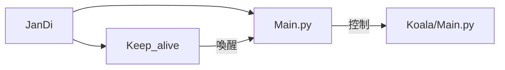
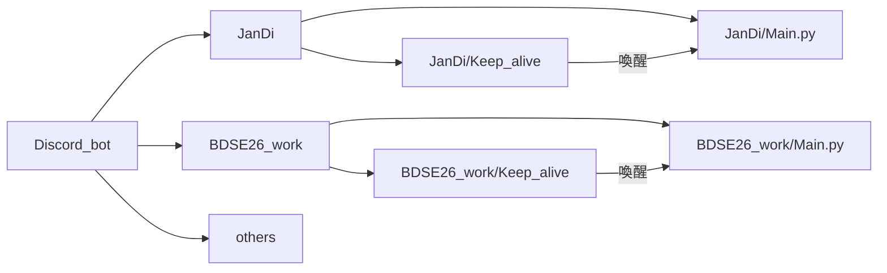

# Discord_bot
利用主控機器人控制子機器人，不需要ssh進入即可下linux指令

設置一個架構能夠從透過主控機器人控制子機器人，功能包括啟動、停止、重啟子機器人，能夠hotfix主控與子機器人，成功實現完全不需要進入伺服器中下指令即可更改機器人的功能。

技術：Python、Flask、FastAPI

## 整體架構

目前: 外層為主控為`戰地機器人`，透過主控控制內層機器人



未來架構: 外層設一個主控機器人，負責控制內層所有機器人



## 使用方法
把子機器人的檔案放到目錄中，進入伺服器啟動主控機器人，接著就可以在Discord中下指令
```py
啟動子機器人
!!run XXX(子機器人目錄名稱)

關閉子機器人
!!stop XXX(子機器人目錄名稱)

重啟子機器人(hotfix)
!!rerun XXX(子機器人目錄名稱)

下linxu指令
!!bash XXXX(指令)

