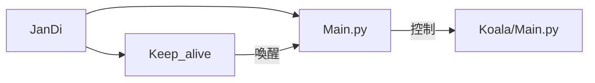

# Discord_bot
利用主控機器人控制子機器人，不需要ssh進入即可下linux指令

架設Discord聊天機器人，由於需要使機器人長期在線上，將程式設置在伺服器，但因安全問題無法從外部SSH進對方家中，因此設置一個架構能夠從對方的Bot(主控)直接控制我的Bot，能夠在Docker內部下Linux指令並回傳訊息至Discord。  
能夠hotfix主控與子機器人，成功實現完全不需要進入伺服器中下指令即可更改機器人的功能。

## 整體架構

目前: 外層為主控為`戰地機器人`，透過主控控制內層機器人



未來架構: 外層設一個主控機器人，負責控制內層所有機器人

```mermaid
graph LR;  
Discord_bot-->JanDi-->JanDi/Main.py;
JanDi-->JanDi/Keep_alive-->|喚醒|JanDi/Main.py;

Discord_bot-->BDSE26_work-->BDSE26_work/Main.py;
BDSE26_work-->BDSE26_work/Keep_alive-->|喚醒|BDSE26_work/Main.py;

Discord_bot-->others
